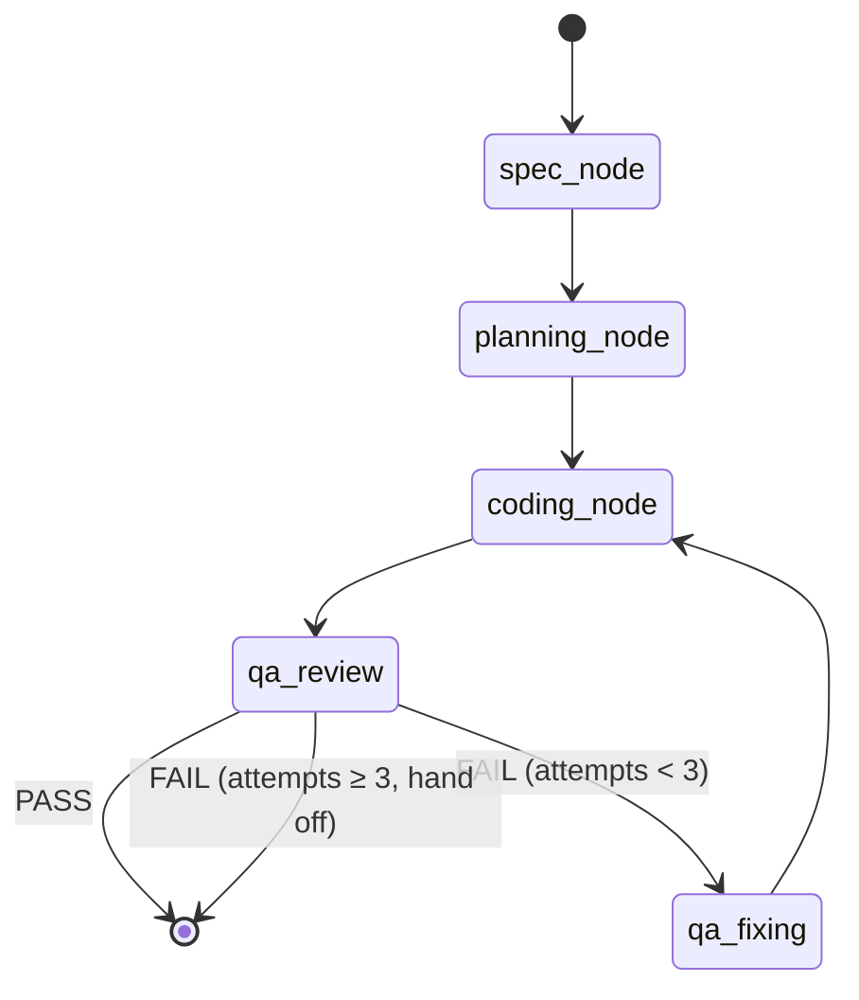

# Agentic Task Execution

Every task on the Board can be handed to an autonomous agent. The agent runs a
five-phase LangGraph pipeline on your machine, streams live progress back to
the card, and supports pause, resume, and mid-run steering — all without
leaving the desktop app.

## The problem with raw `claude -p`

You could run Claude on a task by shelling out to `claude -p "implement this"`.
That works for one-liners, but it gives you nothing useful for real work:

- No structured phases — you can't tell if it's still thinking or stuck
- No checkpointing — a crash or sleep means starting over
- No QA loop — the agent can't verify its own output
- No pause or steer — once running, you're a spectator
- No live observability — just a scrolling terminal, no typed events
- No board integration — subtasks don't appear on the card as work proceeds

The harness-kit agent-server is a dedicated local execution engine built to
solve all of these. It runs on port 4802, communicates over HTTP and WebSocket,
and is designed specifically for per-card autonomous work.

## Architecture

<AgentExecutionDiagram />

## The five-phase pipeline

The agent runs as a LangGraph state graph. Each run starts from the beginning
and checkpoints after every node using SQLite, so it can be paused and resumed
mid-phase without losing work.

The edge from `coding_node` to QA is conditional — it can skip QA entirely for
tasks with no tests. In practice it always runs QA unless the task is
explicitly flagged.

### Phase 1 — Spec

Claude Opus reads the task title, description, and existing subtasks, then
writes a 500–1000 word implementation spec covering approach, key files to
touch, edge cases, and acceptance criteria.

**Output:** `spec` string in graph state, passed forward to all later phases.

### Phase 2 — Planning

Claude decomposes the spec into 8–15 concrete subtasks and writes them to the
board via the Board HTTP API. Each subtask appears on the card in real time
as it's created.

**Output:** `subtasks[]` in graph state, one `agent_subtask` WS event per
subtask created.

### Phase 3 — Coding

An agentic inner loop (≤80 steps) works through each subtask. The agent has
two tool sets:

| Tool set | Tools | Purpose |
|----------|-------|---------|
| **fs-tools** | `read_file`, `write_file`, `edit_file`, `list_directory`, `bash` | File I/O and shell commands inside the task's worktree |
| **board MCP tools** | All board MCP tools via `board-server :4800/mcp` | Update subtask status, post comments, link branches |

Every model invocation that produces prose content emits an `agent_thought`
event. Every tool call emits an `agent_tool` event with `state: start` before
and `state: done` or `state: error` after. These stream live to the card UI.

**Output:** modified files in the worktree, completed subtasks on the board,
`messages[]` in graph state.

### Phase 4 — QA Review

A separate read-only agent reviews the implementation against the spec's
acceptance criteria. It can read files, list directories, and run `bash` (for
tests) but cannot write. It returns `PASS` or `FAIL` with details.

**Output:** `qaPassed: boolean`, `qaAttempts` incremented on failure.

### Phase 5 — QA Fixing (conditional)

If QA fails and `qaAttempts < 3`, the fixing agent reads the QA feedback and
patches the failures, then hands back to coding. After three failed QA
attempts the graph exits and surfaces the failure to the human.

**Retry loop:** `qa_fixing → coding_node → qa_review` repeats up to 3×.

## Pause, resume, and steer

These are first-class operations, not workarounds.

| Action | What happens |
|--------|-------------|
| **Pause** | Aborts the current LangGraph stream. The SQLite checkpointer has already saved state after the last completed node. |
| **Resume** | Re-streams the graph from the last checkpoint — LangGraph picks up exactly where it left off without re-running completed nodes. |
| **Steer** | Injects a `steeringMessage` into graph state while paused. On resume, every node reads this field and incorporates the instruction. Useful for course-correcting mid-run. |

**Important:** you must pause before steering. The steer endpoint rejects
requests while the graph is running.

## The event stream

The agent-server pushes typed events over WebSocket at
`ws://localhost:4802/ws?taskId=<id>&token=<secret>`. The desktop card
subscribes automatically when it detects a running task.

| Event type | Payload | When emitted |
|-----------|---------|--------------|
| `agent_phase` | `taskId, phase, progress` | At the start of each phase (progress 8/20/65/85/92%) |
| `agent_thought` | `taskId, text, timestamp` | When the coding agent produces prose |
| `agent_tool` | `taskId, tool, action, path, state, output?` | Before and after every tool call |
| `agent_subtask` | `taskId, subtaskId, status` | When a subtask is created or updated |
| `agent_steered` | `taskId` | After a steering message is accepted |
| `agent_done` | `taskId, exitCode` | When the graph reaches END normally |
| `agent_error` | `taskId, message` | On unhandled errors |

The full discriminated union is defined in
`packages/agent-server/src/types.ts`.

## Security and boundaries

The agent-server is designed to be local-first and restricted:

- **Runs entirely on your machine** — no data leaves `localhost`
- **Bearer token auth** — token stored at `~/.harness-kit/agent-server.token`
  (mode 0600), generated on first start, read by the desktop app via a Tauri
  command; all HTTP routes and WebSocket upgrades require it
- **CORS locked to Tauri** — `Access-Control-Allow-Origin: tauri://localhost`
  only; browser tabs cannot reach the agent-server
- **Worktree isolation** — the coding and QA-fixing agents receive
  `worktree_path` from the task; all file-system tool calls are rooted there
- **Tool allowlist** — `StartAgentOptions.allowedTools` lets you restrict which
  tools the agent can use (e.g., `["read_file", "list_directory"]` for a
  read-only run)

## What you get vs. raw Claude Code

| Capability | Raw `claude -p` | Board agent-server |
|------------|----------------|-------------------|
| Structured phases with progress | ✗ | ✓ (5 phases, % progress) |
| Live subtask creation on the card | ✗ | ✓ (planning node writes to board) |
| Pause and resume | ✗ | ✓ (SQLite checkpoint) |
| Mid-run steering | ✗ | ✓ (steeringMessage channel) |
| Automated QA loop | ✗ | ✓ (up to 3 fix attempts) |
| Typed WebSocket event stream | ✗ | ✓ (agent_phase/thought/tool/subtask) |
| Isolated worktree per task | Manual | ✓ (board-server spins up worktree) |
| Board status written back | Manual | ✓ (PATCH /execution on done/fail) |

## Related

- [Board](/docs/apps/board) — the Kanban surface that surfaces agent execution
- [Understanding Agents](/docs/concepts/agents) — Claude Code subagents
  (AGENT.md, custom subagent definitions) — distinct from this execution engine
